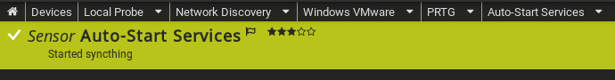
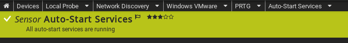

# PRTG Auto-Start Services Monitor
An alternative to WMI monitoring method that doesn't require PRTG to have a user account on the target machine or domain admin credentials; with options to auto-start whitelisted services.

This script runs on the *target machine*, rather than the probe device/PRTG and utilizes the PRTG API for sensor alerts.

***
A service (re)started by this script:


***
All clear response from the API:


***

## Features
- Doesn't require any user account on the target machine
- Runs via a task on the target machine & communicates only need-to-know info to PRTG via the PRTG API
- Option to force start monitored services automatically (if they're not running)
- Debugging option to see exactly what data is seen and posted to PRTG

## Minimum Requirements
These are not *hard* requirements, necessarily; but haven't been tested on anything but the (minimum) versions below:

Target machine:
- Windows Server 2016
- Powershell version: `$PSVersionTable.PSVersion`

```text
Major  Minor  Build  Revision
-----  -----  -----  --------
5      1      14393  3471   
```

PRTG:
- Version:  20.1.57.1745+ (check your dashboard footer)


## Install / Setup
- Assess **prtg-autoservices-monitor.ps1** code to ensure nothing bad will be done to your system & no data will be stolen upon running it
- If all checks out, add **prtg-autoservices-monitor.ps1** to your target system, somewhere like `C:\Scripts` is usually a good spot

On the PRTG dashboard:
- On the device (server) you want to monitor these services for, locate it's device (Search > enter name > click to it > + Add Sensor)
- Search for **HTTP Push Data Advanced**
  - Sensor Name: Auto-Start Services
  - SSL Settings: HTTPS
  - Request Method: POST
  - No incoming data: Switch to unknown
  - Create

 Once it's created, you need to go to the device/server's overview and you'll see **Auto-Start** services listed as a new sensor.  
 - Click to it and go to its **Settings**
 - Set the interval to *15 minutes*
 - You'll see the **Identification Token** field populated, copy it and paste into the `$prtgToken` of the **prtg-autoservices-monitor.ps1** script
 - Save the sensor changes
 - Modify the `$prtgUrl` variable and set your PRTG's instance URL
 - Save

## Setup the Task Schedule
Using the Windows Task Scheduler GUI
- On the target machine, open *Task Scheduler*
- Create a Task (right pane)


- **General tab:**
  - Name: `PRTG Service Monitor`
  - Description: `Monitor autostart services and report back to PRTG.`
  - When running the task, use the following user account: click **Change User or Group** > ensure **From this location:** is set to your local machine (not an AD domain) > type `SYSTEM` under the *Enter the object name to select* > click OK
  - [x] Run with highest privileges
  - Configure for: `Windows Server 2016`


- **Triggers tab:**
  - Click **New**
  - [x] Daily
  - Recur every `1` days
  - Repeat task every: `30 minutes` (or your preferred duration - don't do too frequent or Powershell information logs will bloat/write excessively)
  - for a duration of: `Indefinitely`
  - [x] Enabled


- **Actions tab:**
  - Click **New**
  - Program/script: `powershell`
  - Add arguments: `C:\Scripts\prtg-autoservices-monitor.ps1` (adjust path accordingly, if you put it elsewhere)


- **Conditions tab:**
  - Uncheck all


- **Settings tab:**
  - Tick all & set preferred durations; leave *If the task is not scheduled to run again, delete it after* **blank/unchecked**

## Customizing
**Services you don't care about**; anything that doesn't have the **Startup Type** of Automatic or Automatic (Delayed) is ignored by default - sometimes Windows likes to add services that aren't integral as automatic startup, so that's mostly what you'd add here.
- `$ignore` - Separate service names with '', like so: `$ignore = 'Windows Biometric Service','Software Protection'`

**Services that are important and need to be restarted without manual intervention** - note that if this script does its job, you'll never know the service(s) crashed.. if you need a record of what was restarted, don't use **$debug** for that, or you'll rapidly fill your harddisk space - perhaps extend the debug option and only record what's useful to you.
- `$forceStart` - This variable operates the same way as `$ignore`

**Debugging/testing** or survey what's being sent to PRTG
- `$debug` - Set to `1` and check the path specified in `$logPath` for your output (make sure the path exists!)

## Caveats
`$debug` is noisy and won't clean up after itself when you switch it off, don't use it unless you're actively trying to test this script!

## Troubleshooting
If you run the script in Powershell ISE for the first time and see:
> Invoke-RestMethod : Unable to connect to the remote server
At C:\Scripts\prtg-autoservices-monitor.ps1

Check your firewall rules if using this script across subnets.  Ensure the following is set in your firewall:
- Source: Target server
- Destination: PRTG server
- Port: 5051

## Optional/Disable Noisy Task Logs
Disable unnecessary logging on Windows -- *be aware doing the following will disable ALL tasks' history from being logged* until you toggle it back on.
- Open Task Scheduler as admin/elevated
- In the right pane, you should see a **Disable All Tasks History** button
- To revert or begin logging again, repeat the steps for **Enable All Tasks History**

It doesn't appear possible to quiet the **Information** logs for Powershell (Event ID 40962, 40961, 53504) - so if you have the task running every minute this garbage is going to fill up and write constantly.

## Credits
Original codebase from [Stephan Linke | Paessler AG](https://kb.paessler.com/en/topic/67869-auto-starting-services)

My modifications are licensed under GPL 3
